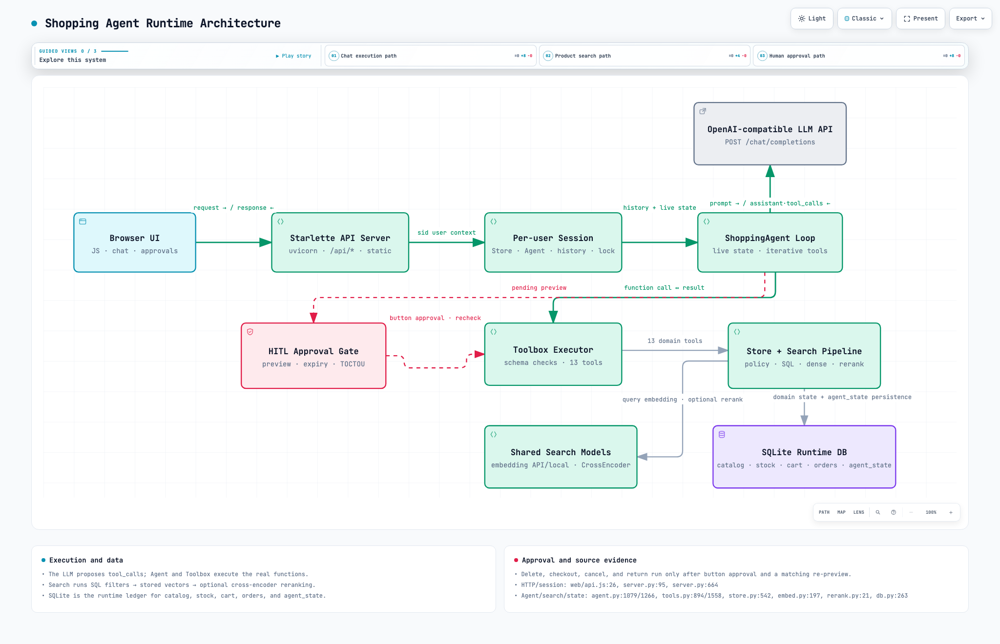

# ShopMate: Tool-Calling Shopping Agent

한국어 자연어 요청을 상품 검색, 비교, 장바구니, 주문, 취소·반품 도구로 연결하는 쇼핑 에이전트입니다.  
정확한 상품 조건은 SQLite로 필터링하고, 표현하기 어려운 취향과 용도는 Dense 임베딩과 Cross-Encoder 리랭커로 정렬합니다. 결제·취소·반품처럼 상태를 변경하는 작업은 사용자의 명시적인 승인을 받은 뒤 실행합니다.

이 저장소는 발표와 포트폴리오를 위해 정리한 **8차 검증 기준 버전**입니다. 실험 과정의 원시 로그와 채택하지 않은 검색 방식은 제외하고, 실제 실행에 필요한 코드와 대표 결과만 남겼습니다.

## 핵심 기능

- OpenAI 호환 API의 구조화된 Tool Calling
- 카테고리·성별·가격·색상·사이즈 등의 SQLite 필터링
- `jhgan/ko-sroberta-multitask` 기반 한국어 의미 검색
- Dense 후보 최대 50개에 대한 Cross-Encoder 리랭킹
- 장바구니, 주문 조회, 결제, 취소, 반품 도구
- 상태 변경 전 사용자 승인(Human-in-the-loop)
- 승인 대기 상태와 대화 상태의 SQLite 영속화 및 시간 만료
- 동일한 상태 변경 도구의 중복 실행 방지
- 선택적으로 켤 수 있는 계획 모드와 결과 검증 단계

## 전체 구조



```text
사용자 요청
  → LLM이 구조화 조건과 semantic_query 추출
  → SQLite SQL 필터링
  → semantic_query가 있으면 질의 임베딩 생성
  → 상품 임베딩과 코사인 유사도 계산
  → 유사도 기준 통과 후보 선택(최대 50개)
  → 명시 정렬 또는 Cross-Encoder 리랭킹
  → 검색 결과 반환
  → 상태 변경 작업은 승인 후 실행
```

### 검색 계층

1. **SQL 필터**는 카테고리, 성별, 브랜드, 가격, 색상, 사이즈, 소재처럼 명확한 조건을 처리합니다.
2. **Dense 검색**은 “가볍고 오래 걸어도 편한”, “봄에 걸치기 좋은”처럼 구조화하기 어려운 의미 조건을 처리합니다.
3. 유사도 기준을 통과한 결과가 너무 적으면 최소 한 줄에 해당하는 후보를 점수순으로 보완합니다.
4. 사용자가 가격·평점·리뷰 정렬을 명시하지 않았다면 질의와 상품 설명을 함께 읽는 Cross-Encoder가 최종 순서를 정합니다.

### 에이전트 실행 계층

모델은 도구 이름과 JSON 인자를 반환하고, 애플리케이션은 스키마와 도메인 규칙을 검증한 뒤 실행합니다. 결제·취소·반품 등 되돌리기 어려운 작업은 즉시 실행하지 않고 확인 버튼을 표시합니다. 승인 정보는 SQLite에 저장되며, 기본 5분이 지나거나 승인 전 상태가 달라지면 실행하지 않습니다.

복합 요청을 위한 계획 모드는 선택 사항입니다. 실험에서 계획은 승인과 조회가 여러 갈래로 얽힌 요청에는 도움이 됐지만, 단순한 요청에서는 모델 호출과 입력 토큰을 늘렸습니다. 따라서 기본값은 꺼짐이며 필요할 때만 `PLAN_MODE=1`로 활성화합니다.

## 기술 구성

- Python, Starlette, SQLite
- Vanilla JavaScript
- OpenAI-compatible Chat Completions / Tool Calling
- Sentence Transformers, NumPy
- `jhgan/ko-sroberta-multitask` (768차원)
- `cross-encoder/mmarco-mMiniLMv2-L12-H384-v1`

## 실행 방법

Python 3.11 이상을 권장합니다. 최초 실행 시 임베딩 모델과 리랭커 모델을 내려받기 때문에 인터넷 연결과 별도의 디스크 공간이 필요합니다.

```bash
python3 -m venv .venv
source .venv/bin/activate
python -m pip install -r requirements.txt

cp .env.example .env
python server.py
```

브라우저에서 `http://127.0.0.1:8000`을 엽니다.

`.env`에는 사용할 OpenAI 호환 모델 서버 정보를 입력합니다.

```dotenv
LOCAL_API_BASE_URL=http://127.0.0.1:4000/v1
MODEL_NAME=your-tool-calling-model
LOCAL_API_KEY=
```

`data/catalog.seed.db`에는 2,419개 데모 상품과 사전 계산된 768차원 상품 임베딩이 들어 있습니다. 실행 시 이 파일을 복사해 `data/shop.db`를 만들며, 장바구니와 주문 같은 사용자 상태는 복사본에만 저장합니다. `shop.db`는 Git에 포함되지 않습니다.

## 핵심 테스트

```bash
python test_sql_search.py
python test_hardening.py
```

- `test_sql_search.py`: SQL 조건, 의미 검색, 임계값, 리랭킹 경로 확인
- `test_hardening.py`: 도구 인자 검증, 승인, 중복 실행 방지 등 주요 회귀 확인

## 평가 요약

최종 검색 전략은 구조화 조건을 SQL로 먼저 적용한 뒤 Dense 점수로 최대 50개를 고르는 방식입니다. 고정된 silver test 16개에서 다음 결과를 기록했습니다.

| 지표 | 결과 |
|---|---:|
| nDCG@10 | 0.880 |
| MRR@10 | 0.844 |
| Precision | 0.894 |
| Recall | 0.621 |
| F1 | 0.733 |

평가 정답은 상품 설명에서 생성한 합성 데이터이므로 최종 품질을 보장하지 않습니다. 실제 서비스에서는 사용자 검색 로그와 사람의 관련도 판정을 이용해 임계값과 리랭킹 품질을 다시 검증해야 합니다. 자세한 범위와 한계는 [평가 요약](docs/evaluation.md)에 정리했습니다.

## 주요 설계 선택

- 상품 수가 2,419개인 현재 규모에서는 별도 Vector DB보다 SQLite BLOB과 메모리 행렬이 단순하고 충분했습니다.
- 상품 한 개를 하나의 검색 문서로 취급하므로 별도 청킹을 적용하지 않았습니다.
- 모델은 도구를 선택하지만, 가격·재고·취소 가능 여부 같은 정책 판정은 코드와 DB가 담당합니다.
- 검색 결과 개수는 모델이 정하지 않으며 검색 계층의 기준과 최대 50개 제한으로 관리합니다.

## 한계

- 공개된 평가는 실제 사용자 로그가 아닌 silver evaluation입니다.
- 임베딩 모델과 Cross-Encoder의 최초 로딩 비용이 있습니다.
- 데모 세션 쿠키는 사용자 인증 수단이 아닙니다.
- 멀티 프로세스 환경의 분산 세션과 대규모 ANN 검색은 구현 범위에 포함하지 않았습니다.
- 계획 모드는 모든 요청의 성공률이나 비용을 일관되게 개선하지 않습니다.

## 공개 저장소 범위

이 저장소에는 실행에 필요한 소스, 공개용 카탈로그 DB, 핵심 테스트, 대표 평가 요약만 포함합니다. 실제 실행 DB, API 키, 원시 실험 로그, 발표 자료 및 중간 생성 파일은 포함하지 않습니다.
